Machine Learning and Econometrics

Introduction Lecture: American Economic Association Continuing Education Program, January 2018

Course Description:
The course will cover topics on the intersection of machine learning and econometrics.
There will be particular emphasis on the use of machine learning methods for estimating
causal effects. In addition there will be some discussion of basic machine learning methods
that we view as useful tools for empirical economists.

### Summary


### Work

Clean environment, load packages


```r
rm(list=ls())

packages <- c("devtools"
  ,"randomForest" 
  ,"rpart" # decision tree
  ,"rpart.plot" # enhanced tree plots
  ,"ROCR"
  ,"Hmisc"
  ,"corrplot"
  ,"texreg"
  ,"glmnet"
  ,"reshape2"
  ,"knitr"
  ,"xtable"
  ,"lars"
  ,"ggplot2"
  ,"matrixStats"
  ,"plyr"
  ,"stargazer")


not_installed <- !packages %in% installed.packages()
if (any(not_installed)) install.packages(packages[not_installed])
lapply(packages,require,character.only=TRUE)
```

```
## Loading required package: devtools
```

```
## Loading required package: randomForest
```

```
## Warning: package 'randomForest' was built under R version 3.4.4
```

```
## randomForest 4.6-14
```

```
## Type rfNews() to see new features/changes/bug fixes.
```

```
## Loading required package: rpart
```

```
## Loading required package: rpart.plot
```

```
## Warning: package 'rpart.plot' was built under R version 3.4.4
```

```
## Loading required package: ROCR
```

```
## Warning: package 'ROCR' was built under R version 3.4.4
```

```
## Loading required package: gplots
```

```
## Warning: package 'gplots' was built under R version 3.4.4
```

```
## 
## Attaching package: 'gplots'
```

```
## The following object is masked from 'package:stats':
## 
##     lowess
```

```
## Loading required package: Hmisc
```

```
## Warning: package 'Hmisc' was built under R version 3.4.4
```

```
## Loading required package: lattice
```

```
## Loading required package: survival
```

```
## Loading required package: Formula
```

```
## Warning: package 'Formula' was built under R version 3.4.4
```

```
## Loading required package: ggplot2
```

```
## Warning: package 'ggplot2' was built under R version 3.4.4
```

```
## 
## Attaching package: 'ggplot2'
```

```
## The following object is masked from 'package:randomForest':
## 
##     margin
```

```
## 
## Attaching package: 'Hmisc'
```

```
## The following objects are masked from 'package:base':
## 
##     format.pval, units
```

```
## Loading required package: corrplot
```

```
## Warning: package 'corrplot' was built under R version 3.4.4
```

```
## corrplot 0.84 loaded
```

```
## Loading required package: texreg
```

```
## Warning: package 'texreg' was built under R version 3.4.4
```

```
## Version:  1.36.23
## Date:     2017-03-03
## Author:   Philip Leifeld (University of Glasgow)
## 
## Please cite the JSS article in your publications -- see citation("texreg").
```

```
## Loading required package: glmnet
```

```
## Warning: package 'glmnet' was built under R version 3.4.4
```

```
## Loading required package: Matrix
```

```
## Loading required package: foreach
```

```
## Warning: package 'foreach' was built under R version 3.4.4
```

```
## Loaded glmnet 2.0-16
```

```
## Loading required package: reshape2
```

```
## Loading required package: knitr
```

```
## Warning: package 'knitr' was built under R version 3.4.4
```

```
## Loading required package: xtable
```

```
## 
## Attaching package: 'xtable'
```

```
## The following objects are masked from 'package:Hmisc':
## 
##     label, label<-
```

```
## Loading required package: lars
```

```
## Loaded lars 1.2
```

```
## Loading required package: matrixStats
```

```
## Warning: package 'matrixStats' was built under R version 3.4.4
```

```
## Loading required package: plyr
```

```
## 
## Attaching package: 'plyr'
```

```
## The following object is masked from 'package:matrixStats':
## 
##     count
```

```
## The following objects are masked from 'package:Hmisc':
## 
##     is.discrete, summarize
```

```
## Loading required package: stargazer
```

```
## Warning: package 'stargazer' was built under R version 3.4.4
```

```
## 
## Please cite as:
```

```
##  Hlavac, Marek (2018). stargazer: Well-Formatted Regression and Summary Statistics Tables.
```

```
##  R package version 5.2.2. https://CRAN.R-project.org/package=stargazer
```

```
## [[1]]
## [1] TRUE
## 
## [[2]]
## [1] TRUE
## 
## [[3]]
## [1] TRUE
## 
## [[4]]
## [1] TRUE
## 
## [[5]]
## [1] TRUE
## 
## [[6]]
## [1] TRUE
## 
## [[7]]
## [1] TRUE
## 
## [[8]]
## [1] TRUE
## 
## [[9]]
## [1] TRUE
## 
## [[10]]
## [1] TRUE
## 
## [[11]]
## [1] TRUE
## 
## [[12]]
## [1] TRUE
## 
## [[13]]
## [1] TRUE
## 
## [[14]]
## [1] TRUE
## 
## [[15]]
## [1] TRUE
## 
## [[16]]
## [1] TRUE
## 
## [[17]]
## [1] TRUE
```

Setwd


```r
setwd("C:/Users/Gateway/Desktop/Dropbox/Data Science/ML Susan Athey/My Repository/Machine-Learning-and-Econometrics-AEA-2018")
```

Load data (large file is 156mb)
Sample is 45mb


```r
#social_full <- read.csv("C:/Users/Gateway/Desktop/ExperimentData-master/ExperimentData-master/Social/RawData/social/social.csv")
#colnames(social_full)

social <- read.csv("C:/Users/Gateway/Desktop/Dropbox/Data Science/ML Susan Athey/R tutorial/socialneighbor.csv")
colnames(social)
```

```
##  [1] "sex"                          "yob"                         
##  [3] "g2000"                        "g2002"                       
##  [5] "g2004"                        "p2000"                       
##  [7] "p2002"                        "cluster"                     
##  [9] "votedav"                      "dem"                         
## [11] "nov"                          "aug"                         
## [13] "city"                         "hh_id"                       
## [15] "hh_size"                      "totalpopulation_estimate"    
## [17] "percent_male"                 "percent_female"              
## [19] "median_age"                   "percent_under5years"         
## [21] "percent_5to9years"            "percent_10to14years"         
## [23] "percent_15to19years"          "percent_20to24years"         
## [25] "percent_25to34years"          "percent_35to44years"         
## [27] "percent_45to54years"          "percent_55to59years"         
## [29] "percent_60to64years"          "percent_65to74years"         
## [31] "percent_75to84years"          "percent_85yearsandolder"     
## [33] "percent_18yearsandolder"      "percent_21yearsandover"      
## [35] "percent_62yearsandover"       "percent_65yearsandover"      
## [37] "percent_white"                "percent_black"               
## [39] "percent_amindian_alaskan"     "percent_asian"               
## [41] "percent_nativeandother"       "percent_other_nativeandother"
## [43] "percent_hispanicorlatino"     "percent_race_other"          
## [45] "median_income"                "mean_income"                 
## [47] "employ_16"                    "unemploy_16"                 
## [49] "unemploy_20to64"              "employ_20to64"               
## [51] "employ_rename_20to64"         "hsorhigher"                  
## [53] "bach_orhigher"                "less9thgrade"                
## [55] "grade9to12"                   "highschool"                  
## [57] "somecollege"                  "assoc"                       
## [59] "bachelors"                    "grad"                        
## [61] "outcome_voted"                "treatment_dum"               
## [63] "treat_hawthorne"              "treat_civic"                 
## [65] "treat_neighbors"              "treat_self"                  
## [67] "randn"                        "oneperhh"                    
## [69] "p2004"
```

Generate 'noise covariates' and them bind to data
Noise covariates defined:


```r
set.seed(333)
noise.covars <- matrix(data = runif(nrow(social) * 13),
                       nrow = nrow(social), ncol = 13)
noise.covars <- data.frame(noise.covars)
names(noise.covars) <- c("noise1", "noise2", "noise3", "noise4", "noise5", "noise6",
                         "noise7", "noise8", "noise9", "noise10", "noise11", "noise12", "noise13")

working <- cbind(social, noise.covars)
```

Run on a subsample, this is already the main dataset in this practice


```r
set.seed(666)
working <- working[sample(nrow(social), 20000), ]

# Pick a selection of covariates
# If we have a lot of data and computation power, it is suggested that
# we include all covariates and use regularization. This suggestion is
# based on the observation that it's much easier to fix the overfitting 
# problem than to fix the underfitting problem.
covariate.names <- c("yob", "hh_size", "sex", "city", "g2000","g2002", "p2000", "p2002", "p2004"
                     ,"totalpopulation_estimate","percent_male","median_age", "percent_62yearsandover"
                     ,"percent_white", "percent_black", "median_income",
                     "employ_20to64", "highschool", "bach_orhigher","percent_hispanicorlatino",
                     "noise1", "noise2", "noise3", "noise4", "noise5", "noise6",
                     "noise7", "noise8", "noise9", "noise10", "noise11", "noise12","noise13")
```

The dependent (outcome) variable is whether the person voted, so let's rename "outcome_voted" to Y


```r
names(working)[names(working)=="outcome_voted"] <- "Y"
# Extract the dependent variable
Y <- working [["Y"]]
# The treatment is whether they received the "your neighbors are voting" letter
names(working)[names(working)=="treat_neighbors"] <- "W"
# Extract treatment variable & covariates
W <- working[["W"]]
covariates <- working[covariate.names]
```

Some algorithms require our covariates be scaled
The 'scale' function, with default settings, will calculate the mean and standard deviation of the entire vector, 
then "scale" each element by those values by subtracting the mean and dividing the standard deviation


```r
covariates.scaled <- scale(covariates)
processed.unscaled <- data.frame(Y, W, covariates)
processed.scaled <- data.frame(Y, W, covariates.scaled)
```

Some of the models in this practice will require training, validation, and test sets.
Set seed for reproducibility
Divide dataset into training and test set. 
I'll be using a 90-10 split, but you can change this as you feel necessary in the sample command


```r
set.seed(999)
smplmain <- sample(nrow(processed.scaled), round(9*nrow(processed.scaled)/10), replace = FALSE)

processed.scaled.train <- processed.scaled[smplmain, ]
processed.scaled.test <- processed.scaled[-smplmain, ]

y.train <- as.matrix(processed.scaled.train$Y, ncol = 1)
y.test <- as.matrix(processed.scaled.test$Y, ncol = 1)

# Create 45-45-10 sample
smplcausal <- sample(nrow(processed.scaled.train),
                     round(5*nrow(processed.scaled.train)/10), replace = FALSE)
processed.scaled.train.1 <- processed.scaled.train[smplcausal, ]
processed.scaled.train.2 <- processed.scaled.train[-smplcausal, ]
```

### Instructor's note
When we want to scale the variables with the presence of training, validation, and test sets, 
we usually use only the training set to obtain the mean and standard deviation. Then we scale all three sets
using the obtained mean and sd.
#### Creating Formulas
For many of the models, we will need a "formula"
This will be in the format Y ~ X1 + X2 + X3 + ...
For more info, see: http://faculty.chicagobooth.edu/richard.hahn/teaching/formulanotation.pdf


```r
print(covariate.names)
```

```
##  [1] "yob"                      "hh_size"                 
##  [3] "sex"                      "city"                    
##  [5] "g2000"                    "g2002"                   
##  [7] "p2000"                    "p2002"                   
##  [9] "p2004"                    "totalpopulation_estimate"
## [11] "percent_male"             "median_age"              
## [13] "percent_62yearsandover"   "percent_white"           
## [15] "percent_black"            "median_income"           
## [17] "employ_20to64"            "highschool"              
## [19] "bach_orhigher"            "percent_hispanicorlatino"
## [21] "noise1"                   "noise2"                  
## [23] "noise3"                   "noise4"                  
## [25] "noise5"                   "noise6"                  
## [27] "noise7"                   "noise8"                  
## [29] "noise9"                   "noise10"                 
## [31] "noise11"                  "noise12"                 
## [33] "noise13"
```


```r
sumx <- paste(covariate.names, collapse = " + ")  # "X1 + X2 + X3 + ..." makes substitution easier later
interx <- paste(" (",sumx, ")^2", sep="")  # "(X1 + X2 + X3 + ...)^2" makes substitution easier later

# Y ~ X1 + X2 + X3 + ...
linearnotreat <- paste("Y", sumx, sep=" ~ ")
linearnotreat <- as.formula(linearnotreat)
linearnotreat
```

```
## Y ~ yob + hh_size + sex + city + g2000 + g2002 + p2000 + p2002 + 
##     p2004 + totalpopulation_estimate + percent_male + median_age + 
##     percent_62yearsandover + percent_white + percent_black + 
##     median_income + employ_20to64 + highschool + bach_orhigher + 
##     percent_hispanicorlatino + noise1 + noise2 + noise3 + noise4 + 
##     noise5 + noise6 + noise7 + noise8 + noise9 + noise10 + noise11 + 
##     noise12 + noise13
```


```r
linear <- paste("Y", paste("W", sumx, sep=" + "), sep = " ~ ")
linear <- as.formula(linear)
linear
```

```
## Y ~ W + yob + hh_size + sex + city + g2000 + g2002 + p2000 + 
##     p2002 + p2004 + totalpopulation_estimate + percent_male + 
##     median_age + percent_62yearsandover + percent_white + percent_black + 
##     median_income + employ_20to64 + highschool + bach_orhigher + 
##     percent_hispanicorlatino + noise1 + noise2 + noise3 + noise4 + 
##     noise5 + noise6 + noise7 + noise8 + noise9 + noise10 + noise11 + 
##     noise12 + noise13
```

Y ~ W * (X1 + X2 + X3 + ...)
---> X*Z means to include these variables plus the interactions between them


```r
linearhet <- paste("Y", paste("W * (", sumx, ") ", sep=""), sep = " ~ ")
linearhet <- as.formula(linearhet)
linearhet
```

```
## Y ~ W * (yob + hh_size + sex + city + g2000 + g2002 + p2000 + 
##     p2002 + p2004 + totalpopulation_estimate + percent_male + 
##     median_age + percent_62yearsandover + percent_white + percent_black + 
##     median_income + employ_20to64 + highschool + bach_orhigher + 
##     percent_hispanicorlatino + noise1 + noise2 + noise3 + noise4 + 
##     noise5 + noise6 + noise7 + noise8 + noise9 + noise10 + noise11 + 
##     noise12 + noise13)
```

### We can now use these formulas to do linear regression and logit regressions
### Linear Regression


```r
lm.linear <- lm(linear, data = processed.scaled)
summary(lm.linear)
```

```
## 
## Call:
## lm(formula = linear, data = processed.scaled)
## 
## Residuals:
##     Min      1Q  Median      3Q     Max 
## -0.7368 -0.3321 -0.2122  0.5315  1.0422 
## 
## Coefficients:
##                            Estimate Std. Error t value Pr(>|t|)    
## (Intercept)               0.2981038  0.0034471  86.479  < 2e-16 ***
## W                         0.0891277  0.0084792  10.511  < 2e-16 ***
## yob                      -0.0267036  0.0034734  -7.688 1.56e-14 ***
## hh_size                   0.0072574  0.0033282   2.181 0.029228 *  
## sex                      -0.0034809  0.0031563  -1.103 0.270107    
## city                      0.0441209  0.0033727  13.082  < 2e-16 ***
## g2000                    -0.0159098  0.0034453  -4.618 3.90e-06 ***
## g2002                     0.0329267  0.0034288   9.603  < 2e-16 ***
## p2000                     0.0488377  0.0032316  15.113  < 2e-16 ***
## p2002                     0.0578063  0.0032825  17.611  < 2e-16 ***
## p2004                     0.0717669  0.0032320  22.205  < 2e-16 ***
## totalpopulation_estimate  0.0181579  0.0040617   4.470 7.85e-06 ***
## percent_male             -0.0071904  0.0038105  -1.887 0.059180 .  
## median_age                0.0116518  0.0076335   1.526 0.126924    
## percent_62yearsandover    0.0012904  0.0075448   0.171 0.864198    
## percent_white             0.0121015  0.0081836   1.479 0.139221    
## percent_black             0.0161190  0.0073676   2.188 0.028695 *  
## median_income             0.0274884  0.0072751   3.778 0.000158 ***
## employ_20to64            -0.0089059  0.0044864  -1.985 0.047150 *  
## highschool                0.0245081  0.0114049   2.149 0.031653 *  
## bach_orhigher            -0.0068557  0.0125007  -0.548 0.583408    
## percent_hispanicorlatino -0.0027757  0.0042682  -0.650 0.515487    
## noise1                   -0.0066916  0.0031515  -2.123 0.033741 *  
## noise2                   -0.0028134  0.0031518  -0.893 0.372069    
## noise3                   -0.0060408  0.0031515  -1.917 0.055278 .  
## noise4                    0.0003293  0.0031510   0.105 0.916770    
## noise5                   -0.0003904  0.0031522  -0.124 0.901434    
## noise6                   -0.0022741  0.0031528  -0.721 0.470731    
## noise7                   -0.0006334  0.0031521  -0.201 0.840750    
## noise8                   -0.0015779  0.0031516  -0.501 0.616623    
## noise9                   -0.0011737  0.0031521  -0.372 0.709627    
## noise10                  -0.0027257  0.0031519  -0.865 0.387166    
## noise11                  -0.0022378  0.0031516  -0.710 0.477685    
## noise12                  -0.0007681  0.0031522  -0.244 0.807494    
## noise13                   0.0001813  0.0031512   0.058 0.954119    
## ---
## Signif. codes:  0 '***' 0.001 '**' 0.01 '*' 0.05 '.' 0.1 ' ' 1
## 
## Residual standard error: 0.4453 on 19965 degrees of freedom
## Multiple R-squared:  0.07922,	Adjusted R-squared:  0.07766 
## F-statistic: 50.52 on 34 and 19965 DF,  p-value: < 2.2e-16
```


```r
lm.linearhet <- lm(linearhet, data = processed.scaled)
summary(lm.linearhet)
```

```
## 
## Call:
## lm(formula = linearhet, data = processed.scaled)
## 
## Residuals:
##     Min      1Q  Median      3Q     Max 
## -0.7730 -0.3292 -0.2091  0.5290  1.0275 
## 
## Coefficients:
##                              Estimate Std. Error t value Pr(>|t|)    
## (Intercept)                 0.2980799  0.0034454  86.515  < 2e-16 ***
## W                           0.0885277  0.0084929  10.424  < 2e-16 ***
## yob                        -0.0255813  0.0037992  -6.733 1.70e-11 ***
## hh_size                     0.0096467  0.0036456   2.646  0.00815 ** 
## sex                        -0.0041477  0.0034541  -1.201  0.22984    
## city                        0.0436233  0.0036815  11.849  < 2e-16 ***
## g2000                      -0.0151126  0.0037896  -3.988 6.69e-05 ***
## g2002                       0.0344670  0.0037640   9.157  < 2e-16 ***
## p2000                       0.0506877  0.0035322  14.350  < 2e-16 ***
## p2002                       0.0568948  0.0035955  15.824  < 2e-16 ***
## p2004                       0.0684929  0.0035357  19.372  < 2e-16 ***
## totalpopulation_estimate    0.0204342  0.0044403   4.602 4.21e-06 ***
## percent_male               -0.0073278  0.0041525  -1.765  0.07763 .  
## median_age                  0.0091513  0.0083699   1.093  0.27425    
## percent_62yearsandover      0.0048100  0.0082368   0.584  0.55925    
## percent_white               0.0198658  0.0090061   2.206  0.02741 *  
## percent_black               0.0209896  0.0081277   2.582  0.00982 ** 
## median_income               0.0307541  0.0079508   3.868  0.00011 ***
## employ_20to64              -0.0136981  0.0048962  -2.798  0.00515 ** 
## highschool                  0.0339743  0.0124684   2.725  0.00644 ** 
## bach_orhigher               0.0033146  0.0136550   0.243  0.80821    
## percent_hispanicorlatino   -0.0003629  0.0046637  -0.078  0.93798    
## noise1                     -0.0054748  0.0034552  -1.585  0.11309    
## noise2                     -0.0008365  0.0034521  -0.242  0.80853    
## noise3                     -0.0037488  0.0034501  -1.087  0.27724    
## noise4                      0.0020763  0.0034435   0.603  0.54654    
## noise5                     -0.0019096  0.0034417  -0.555  0.57901    
## noise6                     -0.0032725  0.0034514  -0.948  0.34306    
## noise7                     -0.0031993  0.0034435  -0.929  0.35286    
## noise8                     -0.0008513  0.0034505  -0.247  0.80514    
## noise9                     -0.0019423  0.0034488  -0.563  0.57331    
## noise10                     0.0009840  0.0034521   0.285  0.77563    
## noise11                    -0.0013815  0.0034496  -0.400  0.68880    
## noise12                     0.0021180  0.0034448   0.615  0.53867    
## noise13                    -0.0004197  0.0034438  -0.122  0.90299    
## W:yob                      -0.0066130  0.0093780  -0.705  0.48072    
## W:hh_size                  -0.0150441  0.0089306  -1.685  0.09209 .  
## W:sex                       0.0049815  0.0085145   0.585  0.55852    
## W:city                      0.0028515  0.0091938   0.310  0.75645    
## W:g2000                    -0.0062835  0.0091127  -0.690  0.49050    
## W:g2002                    -0.0081149  0.0091312  -0.889  0.37418    
## W:p2000                    -0.0108902  0.0087474  -1.245  0.21316    
## W:p2002                     0.0054052  0.0088309   0.612  0.54049    
## W:p2004                     0.0189682  0.0087406   2.170  0.03001 *  
## W:totalpopulation_estimate -0.0152105  0.0110006  -1.383  0.16677    
## W:percent_male              0.0001264  0.0104862   0.012  0.99038    
## W:median_age                0.0102881  0.0204709   0.503  0.61527    
## W:percent_62yearsandover   -0.0164189  0.0205920  -0.797  0.42526    
## W:percent_white            -0.0467292  0.0216546  -2.158  0.03094 *  
## W:percent_black            -0.0285965  0.0193215  -1.480  0.13888    
## W:median_income            -0.0146889  0.0197814  -0.743  0.45776    
## W:employ_20to64             0.0293825  0.0122510   2.398  0.01648 *  
## W:highschool               -0.0580220  0.0308503  -1.881  0.06002 .  
## W:bach_orhigher            -0.0657108  0.0339544  -1.935  0.05297 .  
## W:percent_hispanicorlatino -0.0140987  0.0116109  -1.214  0.22466    
## W:noise1                   -0.0083524  0.0084371  -0.990  0.32221    
## W:noise2                   -0.0104238  0.0084649  -1.231  0.21818    
## W:noise3                   -0.0148297  0.0085031  -1.744  0.08117 .  
## W:noise4                   -0.0107384  0.0085604  -1.254  0.20970    
## W:noise5                    0.0080960  0.0085745   0.944  0.34508    
## W:noise6                    0.0064320  0.0084880   0.758  0.44859    
## W:noise7                    0.0161437  0.0085596   1.886  0.05931 .  
## W:noise8                   -0.0054401  0.0084812  -0.641  0.52125    
## W:noise9                    0.0027495  0.0085067   0.323  0.74654    
## W:noise10                  -0.0228278  0.0084616  -2.698  0.00699 ** 
## W:noise11                  -0.0050631  0.0084807  -0.597  0.55050    
## W:noise12                  -0.0174004  0.0085529  -2.034  0.04192 *  
## W:noise13                   0.0047081  0.0085376   0.551  0.58133    
## ---
## Signif. codes:  0 '***' 0.001 '**' 0.01 '*' 0.05 '.' 0.1 ' ' 1
## 
## Residual standard error: 0.4451 on 19932 degrees of freedom
## Multiple R-squared:  0.08169,	Adjusted R-squared:  0.0786 
## F-statistic: 26.46 on 67 and 19932 DF,  p-value: < 2.2e-16
```

### Logistic Regression
#### see: http://www.ats.ucla.edu/stat/r/dae/logit.htm

This code below estimates a logistic regression model using the glm (generalized linear model) function


```r
mylogit <- glm(linear, data = processed.scaled, family = "binomial")
summary(mylogit)
```

```
## 
## Call:
## glm(formula = linear, family = "binomial", data = processed.scaled)
## 
## Deviance Residuals: 
##     Min       1Q   Median       3Q      Max  
## -1.7282  -0.8773  -0.6723   1.2134   2.3855  
## 
## Coefficients:
##                            Estimate Std. Error z value Pr(>|z|)    
## (Intercept)              -0.9353827  0.0180761 -51.747  < 2e-16 ***
## W                         0.4320998  0.0412556  10.474  < 2e-16 ***
## yob                      -0.1416047  0.0173571  -8.158 3.40e-16 ***
## hh_size                   0.0198581  0.0167536   1.185 0.235898    
## sex                      -0.0172625  0.0159417  -1.083 0.278873    
## city                      0.2119919  0.0163018  13.004  < 2e-16 ***
## g2000                    -0.0682720  0.0177151  -3.854 0.000116 ***
## g2002                     0.1971349  0.0189784  10.387  < 2e-16 ***
## p2000                     0.2343965  0.0156943  14.935  < 2e-16 ***
## p2002                     0.2829572  0.0162650  17.397  < 2e-16 ***
## p2004                     0.3613722  0.0163431  22.112  < 2e-16 ***
## totalpopulation_estimate  0.0902184  0.0206555   4.368 1.26e-05 ***
## percent_male             -0.0353626  0.0192544  -1.837 0.066269 .  
## median_age                0.0629920  0.0394324   1.597 0.110161    
## percent_62yearsandover    0.0007437  0.0385075   0.019 0.984591    
## percent_white             0.0643000  0.0422680   1.521 0.128198    
## percent_black             0.0839444  0.0376215   2.231 0.025662 *  
## median_income             0.1384857  0.0371342   3.729 0.000192 ***
## employ_20to64            -0.0435799  0.0226844  -1.921 0.054714 .  
## highschool                0.1212242  0.0576035   2.104 0.035339 *  
## bach_orhigher            -0.0357604  0.0632524  -0.565 0.571829    
## percent_hispanicorlatino -0.0152049  0.0218944  -0.694 0.487390    
## noise1                   -0.0334910  0.0159208  -2.104 0.035413 *  
## noise2                   -0.0139225  0.0159317  -0.874 0.382183    
## noise3                   -0.0310263  0.0159369  -1.947 0.051556 .  
## noise4                    0.0012227  0.0159248   0.077 0.938796    
## noise5                   -0.0013254  0.0159132  -0.083 0.933621    
## noise6                   -0.0116430  0.0159176  -0.731 0.464502    
## noise7                   -0.0031662  0.0159142  -0.199 0.842301    
## noise8                   -0.0074312  0.0159378  -0.466 0.641026    
## noise9                   -0.0056414  0.0159024  -0.355 0.722776    
## noise10                  -0.0131077  0.0159285  -0.823 0.410560    
## noise11                  -0.0113235  0.0159249  -0.711 0.477050    
## noise12                  -0.0032789  0.0159327  -0.206 0.836952    
## noise13                   0.0011919  0.0159465   0.075 0.940419    
## ---
## Signif. codes:  0 '***' 0.001 '**' 0.01 '*' 0.05 '.' 0.1 ' ' 1
## 
## (Dispersion parameter for binomial family taken to be 1)
## 
##     Null deviance: 24854  on 19999  degrees of freedom
## Residual deviance: 23203  on 19965  degrees of freedom
## AIC: 23273
## 
## Number of Fisher Scoring iterations: 4
```

### LASSO variable selection + OLS
#### see https://web.stanford.edu/~hastie/glmnet/glmnet_alpha.html and also help(glmnet)

LASSO takes in a model.matrix
First parameter is the model (here it is linear, which we previously created)
Second parameter is the dataframe we want to create the matrix from


```r
linear.train <- model.matrix(linear, processed.scaled.train)[,-1]
linear.test <- model.matrix(linear, processed.scaled.test)[,-1]
linear.train.1 <- model.matrix(linear, processed.scaled.train.1)[,-1]
linear.train.2 <- model.matrix(linear, processed.scaled.train.2)[,-1]

# Use cross-validation to select the optimal shrinkage parameter Lambda and the non-zero coefficients
lasso.linear <- cv.glmnet(linear.train.1, y.train[smplcausal, ], alpha = 1, parallel = TRUE)
```

```
## Warning: executing %dopar% sequentially: no parallel backend registered
```

```r
lasso.linear  # prints the model, information overload, but you can see the mse and the non-zero variables and the cross-validation steps
```

```
## $lambda
##  [1] 0.0675649873 0.0615627001 0.0560936395 0.0511104352 0.0465699250
##  [6] 0.0424327812 0.0386631699 0.0352284404 0.0320988429 0.0292472701
## [11] 0.0266490233 0.0242815975 0.0221244873 0.0201590088 0.0183681380
## [16] 0.0167363633 0.0152495509 0.0138948228 0.0126604451 0.0115357260
## [21] 0.0105109239 0.0095771624 0.0087263537 0.0079511285 0.0072447721
## [26] 0.0066011666 0.0060147371 0.0054804044 0.0049935404 0.0045499281
## [31] 0.0041457250 0.0037774302 0.0034418537 0.0031360889 0.0028574874
## [36] 0.0026036361 0.0023723363 0.0021615844 0.0019695552 0.0017945854
## [41] 0.0016351594 0.0014898963 0.0013575380 0.0012369381 0.0011270519
## [46] 0.0010269277 0.0009356983 0.0008525734 0.0007768332 0.0007078215
## [51] 0.0006449405 0.0005876458 0.0005354410 0.0004878739 0.0004445325
## [56] 0.0004050415 0.0003690587 0.0003362725 0.0003063990 0.0002791794
## [61] 0.0002543778 0.0002317796 0.0002111890 0.0001924275 0.0001753328
## [66] 0.0001597567 0.0001455644 0.0001326328 0.0001208501 0.0001101141
## [71] 0.0001003319
## 
## $cvm
##  [1] 0.2164370 0.2150253 0.2132666 0.2114799 0.2098979 0.2085667 0.2073353
##  [8] 0.2061411 0.2050543 0.2040696 0.2032366 0.2025080 0.2019014 0.2013978
## [15] 0.2009796 0.2006374 0.2003680 0.2001445 0.1999499 0.1997793 0.1996389
## [22] 0.1995197 0.1994200 0.1993376 0.1992584 0.1991719 0.1990870 0.1990103
## [29] 0.1989422 0.1988880 0.1988471 0.1988191 0.1987949 0.1987741 0.1987543
## [36] 0.1987367 0.1987253 0.1987169 0.1987092 0.1986986 0.1986907 0.1986842
## [43] 0.1986819 0.1986828 0.1986861 0.1986904 0.1986968 0.1987034 0.1987104
## [50] 0.1987178 0.1987249 0.1987316 0.1987405 0.1987504 0.1987598 0.1987694
## [57] 0.1987783 0.1987861 0.1987935 0.1987995 0.1988055 0.1988098 0.1988147
## [64] 0.1988178 0.1988219 0.1988253 0.1988287 0.1988320 0.1988353 0.1988377
## [71] 0.1988402
## 
## $cvsd
##  [1] 0.001611549 0.001586998 0.001561894 0.001529922 0.001516629
##  [6] 0.001511596 0.001500523 0.001487773 0.001494992 0.001507803
## [11] 0.001520329 0.001506014 0.001495761 0.001489930 0.001487556
## [16] 0.001489292 0.001493582 0.001496523 0.001497255 0.001498128
## [21] 0.001498423 0.001497734 0.001497363 0.001497815 0.001498764
## [26] 0.001499193 0.001503289 0.001507515 0.001507461 0.001504945
## [31] 0.001503970 0.001503045 0.001502514 0.001501884 0.001501475
## [36] 0.001500601 0.001501109 0.001500888 0.001498229 0.001493660
## [41] 0.001490583 0.001488213 0.001485945 0.001484267 0.001483295
## [46] 0.001482469 0.001481891 0.001481424 0.001481237 0.001480942
## [51] 0.001480682 0.001480233 0.001479977 0.001479989 0.001479802
## [56] 0.001479651 0.001479840 0.001480282 0.001480389 0.001480733
## [61] 0.001481125 0.001481212 0.001481458 0.001481605 0.001482024
## [66] 0.001482186 0.001482324 0.001482520 0.001482621 0.001482668
## [71] 0.001482753
## 
## $cvup
##  [1] 0.2180486 0.2166123 0.2148285 0.2130098 0.2114145 0.2100783 0.2088358
##  [8] 0.2076289 0.2065492 0.2055774 0.2047569 0.2040140 0.2033972 0.2028877
## [15] 0.2024672 0.2021267 0.2018615 0.2016410 0.2014471 0.2012775 0.2011373
## [22] 0.2010175 0.2009174 0.2008354 0.2007572 0.2006711 0.2005903 0.2005178
## [29] 0.2004496 0.2003929 0.2003511 0.2003222 0.2002974 0.2002760 0.2002558
## [36] 0.2002373 0.2002264 0.2002178 0.2002074 0.2001923 0.2001813 0.2001724
## [43] 0.2001678 0.2001671 0.2001694 0.2001729 0.2001787 0.2001849 0.2001917
## [50] 0.2001987 0.2002056 0.2002119 0.2002205 0.2002304 0.2002396 0.2002490
## [57] 0.2002582 0.2002664 0.2002739 0.2002802 0.2002866 0.2002910 0.2002961
## [64] 0.2002994 0.2003039 0.2003075 0.2003110 0.2003145 0.2003179 0.2003204
## [71] 0.2003230
## 
## $cvlo
##  [1] 0.2148255 0.2134383 0.2117047 0.2099500 0.2083813 0.2070552 0.2058348
##  [8] 0.2046533 0.2035593 0.2025618 0.2017163 0.2010020 0.2004056 0.1999078
## [15] 0.1994921 0.1991481 0.1988744 0.1986479 0.1984526 0.1982812 0.1981405
## [22] 0.1980220 0.1979227 0.1978397 0.1977597 0.1976727 0.1975837 0.1975028
## [29] 0.1974347 0.1973830 0.1973432 0.1973161 0.1972923 0.1972722 0.1972528
## [36] 0.1972361 0.1972242 0.1972160 0.1972109 0.1972049 0.1972001 0.1971960
## [43] 0.1971959 0.1971986 0.1972028 0.1972079 0.1972149 0.1972220 0.1972292
## [50] 0.1972368 0.1972442 0.1972514 0.1972605 0.1972704 0.1972800 0.1972897
## [57] 0.1972985 0.1973058 0.1973132 0.1973188 0.1973244 0.1973286 0.1973332
## [64] 0.1973362 0.1973399 0.1973431 0.1973464 0.1973495 0.1973526 0.1973551
## [71] 0.1973575
## 
## $nzero
##  s0  s1  s2  s3  s4  s5  s6  s7  s8  s9 s10 s11 s12 s13 s14 s15 s16 s17 
##   0   2   3   4   4   4   6   6   7   7   7   7   7   7   7   7   7   7 
## s18 s19 s20 s21 s22 s23 s24 s25 s26 s27 s28 s29 s30 s31 s32 s33 s34 s35 
##   9   9   9  10  11  13  15  15  16  17  17  17  19  20  22  24  25  25 
## s36 s37 s38 s39 s40 s41 s42 s43 s44 s45 s46 s47 s48 s49 s50 s51 s52 s53 
##  25  25  26  26  26  26  26  27  27  28  31  31  31  31  31  31  32  32 
## s54 s55 s56 s57 s58 s59 s60 s61 s62 s63 s64 s65 s66 s67 s68 s69 s70 
##  33  33  33  33  33  33  33  33  33  34  34  34  34  34  34  34  34 
## 
## $name
##                  mse 
## "Mean-Squared Error" 
## 
## $glmnet.fit
## 
## Call:  glmnet(x = linear.train.1, y = y.train[smplcausal, ], parallel = TRUE,      alpha = 1) 
## 
##       Df     %Dev    Lambda
##  [1,]  0 0.000000 6.756e-02
##  [2,]  2 0.007614 6.156e-02
##  [3,]  3 0.016030 5.609e-02
##  [4,]  4 0.024590 5.111e-02
##  [5,]  4 0.031890 4.657e-02
##  [6,]  4 0.037940 4.243e-02
##  [7,]  6 0.043940 3.866e-02
##  [8,]  6 0.049850 3.523e-02
##  [9,]  7 0.054880 3.210e-02
## [10,]  7 0.059760 2.925e-02
## [11,]  7 0.063810 2.665e-02
## [12,]  7 0.067180 2.428e-02
## [13,]  7 0.069970 2.212e-02
## [14,]  7 0.072290 2.016e-02
## [15,]  7 0.074220 1.837e-02
## [16,]  7 0.075810 1.674e-02
## [17,]  7 0.077140 1.525e-02
## [18,]  7 0.078240 1.389e-02
## [19,]  9 0.079320 1.266e-02
## [20,]  9 0.080260 1.154e-02
## [21,]  9 0.081050 1.051e-02
## [22,] 10 0.081730 9.577e-03
## [23,] 11 0.082380 8.726e-03
## [24,] 13 0.082960 7.951e-03
## [25,] 15 0.083650 7.245e-03
## [26,] 15 0.084360 6.601e-03
## [27,] 16 0.084990 6.015e-03
## [28,] 17 0.085540 5.480e-03
## [29,] 17 0.086020 4.994e-03
## [30,] 17 0.086420 4.550e-03
## [31,] 19 0.086780 4.146e-03
## [32,] 20 0.087110 3.777e-03
## [33,] 22 0.087390 3.442e-03
## [34,] 24 0.087770 3.136e-03
## [35,] 25 0.088080 2.857e-03
## [36,] 25 0.088410 2.604e-03
## [37,] 25 0.088700 2.372e-03
## [38,] 25 0.088940 2.162e-03
## [39,] 26 0.089140 1.970e-03
## [40,] 26 0.089300 1.795e-03
## [41,] 26 0.089450 1.635e-03
## [42,] 26 0.089560 1.490e-03
## [43,] 26 0.089660 1.358e-03
## [44,] 27 0.089740 1.237e-03
## [45,] 27 0.089810 1.127e-03
## [46,] 28 0.089860 1.027e-03
## [47,] 31 0.089910 9.357e-04
## [48,] 31 0.089960 8.526e-04
## [49,] 31 0.089990 7.768e-04
## [50,] 31 0.090020 7.078e-04
## [51,] 31 0.090050 6.449e-04
## [52,] 31 0.090070 5.876e-04
## [53,] 32 0.090090 5.354e-04
## [54,] 32 0.090100 4.879e-04
## [55,] 33 0.090110 4.445e-04
## [56,] 33 0.090120 4.050e-04
## [57,] 33 0.090140 3.691e-04
## [58,] 33 0.090150 3.363e-04
## [59,] 33 0.090170 3.064e-04
## [60,] 33 0.090180 2.792e-04
## [61,] 33 0.090190 2.544e-04
## [62,] 33 0.090190 2.318e-04
## [63,] 33 0.090200 2.112e-04
## [64,] 34 0.090200 1.924e-04
## [65,] 34 0.090210 1.753e-04
## [66,] 34 0.090210 1.598e-04
## [67,] 34 0.090220 1.456e-04
## [68,] 34 0.090220 1.326e-04
## [69,] 34 0.090220 1.209e-04
## [70,] 34 0.090230 1.101e-04
## [71,] 34 0.090230 1.003e-04
## [72,] 34 0.090230 9.142e-05
## [73,] 34 0.090230 8.330e-05
## [74,] 34 0.090230 7.590e-05
## [75,] 34 0.090230 6.915e-05
## [76,] 34 0.090230 6.301e-05
## [77,] 34 0.090230 5.741e-05
## [78,] 34 0.090240 5.231e-05
## 
## $lambda.min
## [1] 0.001357538
## 
## $lambda.1se
## [1] 0.01389482
## 
## attr(,"class")
## [1] "cv.glmnet"
```


```r
plot(lasso.linear)
```

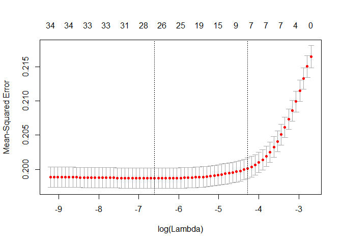<!-- -->


```r
lasso.linear$lambda.min
```

```
## [1] 0.001357538
```

```r
lasso.linear$lambda.1se
```

```
## [1] 0.01389482
```

Lambda.min gives min average cross-validated error
Lambda.1se gives the most regularized model such that error is within one standard error of the min; this value of Lambda is used here


```r
# List non-zero coefficients found. There are two ways to do this.
# coef(lasso.linear, s = lasso.linear$Lambda.1se)  # Method 1
coef <- predict(lasso.linear, type = "nonzero")  # Method 2

# Index the column names of the matrix in order to index the selected variables
colnames <- colnames(linear.train.1)
selected.vars <- colnames[unlist(coef)]

# do OLS using these coefficients
linearwithlass <- paste("Y", paste(append(selected.vars, "W"), collapse=" + "), sep=" ~ ")
linearwithlass <- as.formula(linearwithlass)
lm.linear.lasso <- lm(linearwithlass, data = processed.scaled.train.2)
yhat.linear.lasso <- predict(lm.linear.lasso, newdata=processed.scaled.test)
summary(lm.linear.lasso)
```

```
## 
## Call:
## lm(formula = linearwithlass, data = processed.scaled.train.2)
## 
## Residuals:
##     Min      1Q  Median      3Q     Max 
## -0.6580 -0.3279 -0.2300  0.5566  0.9698 
## 
## Coefficients:
##              Estimate Std. Error t value Pr(>|t|)    
## (Intercept)  0.293154   0.005153  56.888  < 2e-16 ***
## W            0.091033   0.012711   7.162 8.59e-13 ***
## yob         -0.023761   0.004879  -4.870 1.14e-06 ***
## city         0.032799   0.004768   6.880 6.40e-12 ***
## g2002        0.030389   0.004948   6.141 8.52e-10 ***
## p2000        0.039700   0.004786   8.295  < 2e-16 ***
## p2002        0.055877   0.004863  11.489  < 2e-16 ***
## p2004        0.062903   0.004757  13.222  < 2e-16 ***
## ---
## Signif. codes:  0 '***' 0.001 '**' 0.01 '*' 0.05 '.' 0.1 ' ' 1
## 
## Residual standard error: 0.4468 on 8992 degrees of freedom
## Multiple R-squared:  0.06459,	Adjusted R-squared:  0.06386 
## F-statistic:  88.7 on 7 and 8992 DF,  p-value: < 2.2e-16
```

#### LASSO for Logistic Regressions


```r
lasso.logit <- glmnet(linear.train.1, y.train[smplcausal, ], alpha = 1, family = 'binomial')

# visualize the coefficient paths
plot(lasso.logit, label = FALSE)
grid()
```

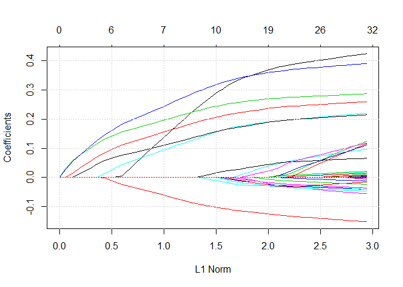<!-- -->

Each variable has one curve, which is the path of its coefficient as the shrinkage parameter Lambda varies.
The axis tells the number of nonzero coefficients at the current value of Lambda, which is the effective degrees of freedom (Df) for the lasso.
You can set label = TRUE in the plot command to annotate the curves.

We can obtain the coefficients at one or more values of Lambda


```r
coef(lasso.logit, s = c(0.03457, 0.007))
```

```
## 35 x 2 sparse Matrix of class "dgCMatrix"
##                                     1            2
## (Intercept)              -0.778327054 -0.881266760
## W                         0.001166563  0.328775749
## yob                      -0.015844036 -0.112389136
## hh_size                   .            .          
## sex                       .           -0.009594590
## city                      0.031598927  0.173158016
## g2000                     .            .          
## g2002                     0.069193247  0.170640401
## p2000                     0.101829638  0.219693398
## p2002                     0.146604394  0.256139599
## p2004                     0.168724176  0.337855726
## totalpopulation_estimate  .            0.002663115
## percent_male              .            .          
## median_age                .            0.025468720
## percent_62yearsandover    .            .          
## percent_white             .            .          
## percent_black             .            .          
## median_income             .            .          
## employ_20to64             .           -0.023302406
## highschool                .            .          
## bach_orhigher             .            .          
## percent_hispanicorlatino  .           -0.006944049
## noise1                    .            .          
## noise2                    .            .          
## noise3                    .           -0.014482094
## noise4                    .            .          
## noise5                    .            .          
## noise6                    .            .          
## noise7                    .            .          
## noise8                    .            .          
## noise9                    .            .          
## noise10                   .           -0.002589183
## noise11                   .            .          
## noise12                   .            .          
## noise13                   .            .
```


```r
# predict with particular values of Lamda (use variable s)
pre.lasso.logit <- predict(lasso.logit, newx = as.matrix(processed.scaled.test[, -1]),
                           s = c(0.03457, 0.007), type = "response")
# If we dont include type = "response" in the predict() formula, it will return the values of log(Y/(1-Y))
## Use cross-validation to choose the optimal lambda
cv.glm.logit <- cv.glmnet(linear.train.1, y.train[smplcausal,], alpha = 1, parallel=TRUE)
plot(cv.glm.logit)
```

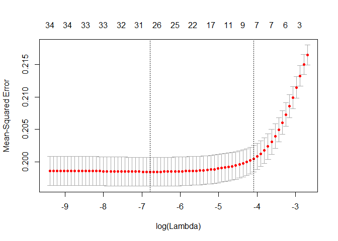<!-- -->


```r
opt.lambda <- cv.glm.logit$lambda.1se
# Some people use lambda.min but it seems that lambda.1se is preferred.
# See the coefficients with the optimally chosen lambda
coef(cv.glm.logit, s = opt.lambda)
```

```
## 35 x 1 sparse Matrix of class "dgCMatrix"
##                                    1
## (Intercept)               0.31063845
## W                         0.04231183
## yob                      -0.01463370
## hh_size                   .         
## sex                       .         
## city                      0.02510321
## g2000                     .         
## g2002                     0.02254541
## p2000                     0.03811089
## p2002                     0.04581018
## p2004                     0.05716766
## totalpopulation_estimate  .         
## percent_male              .         
## median_age                .         
## percent_62yearsandover    .         
## percent_white             .         
## percent_black             .         
## median_income             .         
## employ_20to64             .         
## highschool                .         
## bach_orhigher             .         
## percent_hispanicorlatino  .         
## noise1                    .         
## noise2                    .         
## noise3                    .         
## noise4                    .         
## noise5                    .         
## noise6                    .         
## noise7                    .         
## noise8                    .         
## noise9                    .         
## noise10                   .         
## noise11                   .         
## noise12                   .         
## noise13                   .
```

Instructor's Note:
The results of cv.glmnet are random, since the folkds are selected at random.
If cv.glmnet always uses the same set of covariates (say all covariate), then the results will be stable. Or if we use LOOCV, the results will also be stable.Otherwise, they will vary when we run the function multiple times.


```r
# prediction using cv.glmnet is therefore not stable in general
pre.cv.glm.logit <- predict(cv.glm.logit, newx = as.matrix(processed.scaled.test[, -1]), s = opt.lambda)

# It will be more stable to do prediction using glmnet with the optimal lambda using type = "class" gives the classified category

pre.opt.lambda.lasso.logit <- predict(lasso.logit, 
                              newx = as.matrix(processed.scaled.test[, -1]), 
                              s = opt.lambda, type = "class")
```

### Elastic net for Logistic Regression


```r
# This is almost the same as the previous part, except that we use alpha in (0,1)
elastNet.logit <- glmnet(linear.train.1, y.train[smplcausal,],
                         alpha = 0.2, family = 'binomial')

# plot the coefficient paths against the log-lambda values
plot(elastNet.logit, xvar = "lambda", label = FALSE)
grid()
```

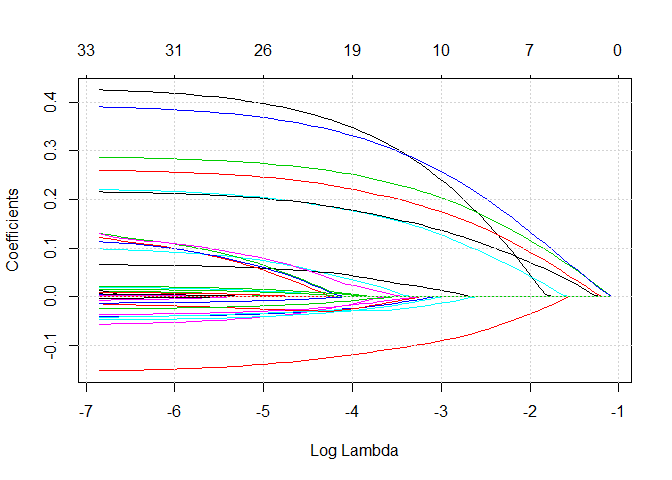<!-- -->

We can also use the same folds so we can select the optimal value for alpha. 
Above, we set alpha = 0.2
Use foldid: a vector of values between 1 and n-fold identifying what fold each observation is in. 


```r
foldid <- sample(1:10, size = length(y.train[smplcausal, ]), replace = TRUE)
cv0.2.elastNet.logit <- cv.glmnet(linear.train.1, y.train[smplcausal,],
                                  foldid = foldid, alpha = 0.2, parallel = TRUE)
cv0.5.elastNet.logit <- cv.glmnet(linear.train.1, y.train[smplcausal,], 
                                  foldid = foldid, alpha = 0.5, parallel = TRUE)
cv0.8.elastNet.logit <- cv.glmnet(linear.train.1, y.train[smplcausal,], 
                                  foldid = foldid, alpha = 0.8, parallel = TRUE)
# plot all three MSE's in the same plot to compare
# par(mfrow = c(2,2))
# plot(cv0.2.elastNet.logit); plot(cv0.5.elastNet.logit); plot(cv0.8.elastNet.logit)
plot(log(cv0.8.elastNet.logit$lambda), cv0.8.elastNet.logit$cvm, pch = 19,
     col = "red", xlab = "log(Lambda)", ylab= cv0.2.elastNet.logit$name)
points(log(cv0.5.elastNet.logit$lambda), cv0.5.elastNet.logit$cvm, pch=19, col="grey")
points(log(cv0.2.elastNet.logit$lambda), cv0.2.elastNet.logit$cvm, pch=19, col="blue")
legend("topleft", legend = c("alpha = 0.8", "alpha = 0.5", "alpha = 0.2"), 
       pch = 19, col = c("red", "grey", "blue"))
```

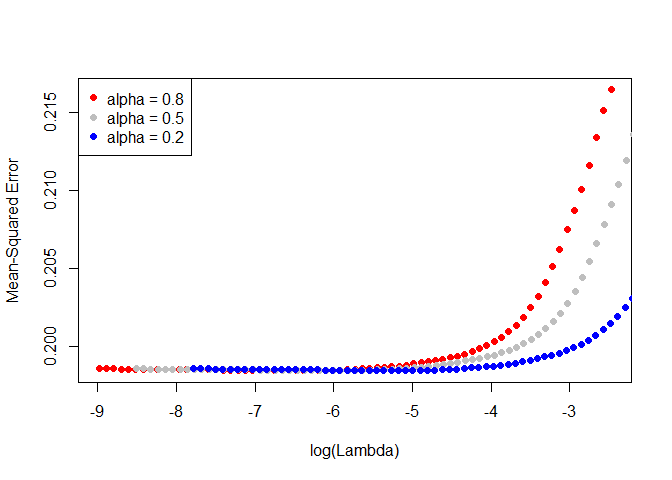<!-- -->

We can plot with more values of alpha to choose the best alpha. According to the plot, it seems like alpha = 0.8 does the best among the three reported values.

Using this alpha, we can find the optimal lambda and coefs as in the previous part. 


```r
opt0.8.lambda <- cv0.8.elastNet.logit$lambda.1se
coef(cv0.8.elastNet.logit, s = opt0.8.lambda)
```

```
## 35 x 1 sparse Matrix of class "dgCMatrix"
##                                    1
## (Intercept)               0.31005094
## W                         0.04592640
## yob                      -0.01558636
## hh_size                   .         
## sex                       .         
## city                      0.02638732
## g2000                     .         
## g2002                     0.02324741
## p2000                     0.03913754
## p2002                     0.04659418
## p2004                     0.05837256
## totalpopulation_estimate  .         
## percent_male              .         
## median_age                .         
## percent_62yearsandover    .         
## percent_white             .         
## percent_black             .         
## median_income             .         
## employ_20to64             .         
## highschool                .         
## bach_orhigher             .         
## percent_hispanicorlatino  .         
## noise1                    .         
## noise2                    .         
## noise3                    .         
## noise4                    .         
## noise5                    .         
## noise6                    .         
## noise7                    .         
## noise8                    .         
## noise9                    .         
## noise10                   .         
## noise11                   .         
## noise12                   .         
## noise13                   .
```

#### Single Tree uses linear formula
Classification Tree with rpart
- grow tree


```r
set.seed(222)
linear.singletree <- rpart(formula = linear, data = processed.scaled.train, 
                           method = "anova", y=TRUE,
                           control= rpart.control(cp=1e-04, minsplit = 30))
linear.singletree$cptable
```

```
##               CP nsplit rel error    xerror        xstd
## 1   0.0199710902      0 1.0000000 1.0001249 0.006020667
## 2   0.0122068068      1 0.9800289 0.9801715 0.006161625
## 3   0.0104325693      2 0.9678221 0.9680268 0.006349642
## 4   0.0057232048      3 0.9573895 0.9576709 0.006323146
## 5   0.0035597260      4 0.9516663 0.9519792 0.006209436
## 6   0.0028280293      5 0.9481066 0.9500636 0.006264535
## 7   0.0024450242      6 0.9452786 0.9476733 0.006330961
## 8   0.0023976190      7 0.9428335 0.9465884 0.006341519
## 9   0.0023587978      8 0.9404359 0.9464410 0.006347260
## 10  0.0021643190      9 0.9380771 0.9445464 0.006367809
## 11  0.0017031944     10 0.9359128 0.9409699 0.006385393
## 12  0.0015132711     11 0.9342096 0.9405348 0.006425653
## 13  0.0015019156     12 0.9326963 0.9397120 0.006441441
## 14  0.0014199223     13 0.9311944 0.9398679 0.006447215
## 15  0.0013093244     14 0.9297745 0.9389807 0.006471241
## 16  0.0012501234     15 0.9284652 0.9393958 0.006503667
## 17  0.0012333097     16 0.9272151 0.9385543 0.006505834
## 18  0.0011106600     17 0.9259818 0.9374158 0.006523775
## 19  0.0010588470     18 0.9248711 0.9367539 0.006558505
## 20  0.0009955041     19 0.9238122 0.9385190 0.006597248
## 21  0.0009935322     20 0.9228167 0.9395241 0.006608222
## 22  0.0009723437     21 0.9218232 0.9397862 0.006622409
## 23  0.0009003928     22 0.9208509 0.9414167 0.006666313
## 24  0.0008391249     23 0.9199505 0.9462698 0.006773557
## 25  0.0008110484     28 0.9157548 0.9490496 0.006867045
## 26  0.0008075887     32 0.9124978 0.9509389 0.006915189
## 27  0.0008043508     37 0.9084599 0.9510963 0.006915184
## 28  0.0007912453     38 0.9076555 0.9526585 0.006955502
## 29  0.0007809415     39 0.9068643 0.9545862 0.007001004
## 30  0.0007796003     40 0.9060834 0.9549157 0.007016788
## 31  0.0007700555     41 0.9053038 0.9560301 0.007042002
## 32  0.0007450420     44 0.9029936 0.9600803 0.007133910
## 33  0.0007396300     45 0.9022486 0.9644635 0.007226566
## 34  0.0007325593     46 0.9015089 0.9661025 0.007264762
## 35  0.0007318453     48 0.9000438 0.9663907 0.007275375
## 36  0.0007204619     54 0.8955521 0.9682226 0.007303973
## 37  0.0007177053     60 0.8910745 0.9716721 0.007370126
## 38  0.0007176042     67 0.8860505 0.9717722 0.007377955
## 39  0.0007049241     68 0.8853329 0.9734899 0.007415862
## 40  0.0007015221     70 0.8839231 0.9775334 0.007496264
## 41  0.0006937195     71 0.8832215 0.9793608 0.007526044
## 42  0.0006925080     72 0.8825278 0.9831676 0.007574256
## 43  0.0006905105     77 0.8790653 0.9847894 0.007591765
## 44  0.0006886253     80 0.8769938 0.9850869 0.007608494
## 45  0.0006871255     81 0.8763051 0.9861982 0.007624686
## 46  0.0006846749     82 0.8756180 0.9866936 0.007632231
## 47  0.0006800454     85 0.8735640 0.9903176 0.007681200
## 48  0.0006772057     87 0.8722039 0.9915825 0.007699576
## 49  0.0006755389     88 0.8715267 0.9913732 0.007705704
## 50  0.0006692841     90 0.8701756 0.9933810 0.007745307
## 51  0.0006605976     95 0.8668292 0.9973043 0.007813160
## 52  0.0006542312     96 0.8661686 1.0021327 0.007898815
## 53  0.0006516815     99 0.8642059 1.0033334 0.007931748
## 54  0.0006512713    103 0.8615992 1.0034505 0.007943608
## 55  0.0006485669    106 0.8596454 1.0036237 0.007948826
## 56  0.0006445336    112 0.8557540 1.0066570 0.008006532
## 57  0.0006423356    113 0.8551094 1.0081978 0.008042289
## 58  0.0006423313    116 0.8531824 1.0082704 0.008043914
## 59  0.0006297333    125 0.8474014 1.0104287 0.008101422
## 60  0.0006228849    127 0.8461420 1.0161337 0.008224536
## 61  0.0006176732    135 0.8411371 1.0173113 0.008261874
## 62  0.0006171262    136 0.8405195 1.0184925 0.008290639
## 63  0.0006114518    137 0.8399023 1.0217691 0.008352750
## 64  0.0006106356    138 0.8392909 1.0241609 0.008385796
## 65  0.0006053884    140 0.8380696 1.0246022 0.008403442
## 66  0.0006031131    144 0.8356398 1.0267761 0.008438446
## 67  0.0005886195    146 0.8344335 1.0308067 0.008517270
## 68  0.0005861807    147 0.8338449 1.0355728 0.008604126
## 69  0.0005861616    148 0.8332587 1.0361396 0.008619919
## 70  0.0005857466    149 0.8326726 1.0357397 0.008618069
## 71  0.0005845278    163 0.8240594 1.0368974 0.008632951
## 72  0.0005821865    166 0.8223058 1.0384075 0.008649212
## 73  0.0005771870    167 0.8217236 1.0409094 0.008684991
## 74  0.0005742565    170 0.8199921 1.0426878 0.008716584
## 75  0.0005679643    171 0.8194178 1.0459489 0.008750578
## 76  0.0005661289    172 0.8188498 1.0469030 0.008777668
## 77  0.0005636504    173 0.8182837 1.0488833 0.008815156
## 78  0.0005624758    177 0.8160291 1.0491231 0.008823767
## 79  0.0005590420    178 0.8154666 1.0505994 0.008843999
## 80  0.0005573666    180 0.8143485 1.0511465 0.008864093
## 81  0.0005568685    181 0.8137912 1.0515886 0.008869628
## 82  0.0005546826    182 0.8132343 1.0528127 0.008885658
## 83  0.0005472003    185 0.8115703 1.0567247 0.008949061
## 84  0.0005459981    188 0.8099287 1.0630876 0.009022926
## 85  0.0005447971    189 0.8093827 1.0632600 0.009027510
## 86  0.0005441591    191 0.8082931 1.0634921 0.009042353
## 87  0.0005436541    196 0.8055649 1.0636164 0.009043346
## 88  0.0005424165    197 0.8050213 1.0650615 0.009060568
## 89  0.0005418680    200 0.8033940 1.0655400 0.009067104
## 90  0.0005415366    201 0.8028522 1.0656987 0.009069412
## 91  0.0005401466    203 0.8017691 1.0663405 0.009076543
## 92  0.0005400068    216 0.7941792 1.0662986 0.009076149
## 93  0.0005324426    217 0.7936391 1.0688258 0.009108389
## 94  0.0005299879    220 0.7920418 1.0718026 0.009146016
## 95  0.0005261631    221 0.7915118 1.0761152 0.009189397
## 96  0.0005256996    223 0.7904595 1.0778028 0.009209108
## 97  0.0005224034    229 0.7873053 1.0791333 0.009232272
## 98  0.0005214053    230 0.7867829 1.0807613 0.009252043
## 99  0.0005208244    231 0.7862615 1.0812968 0.009266314
## 100 0.0005203921    249 0.7762627 1.0812796 0.009267747
## 101 0.0005179003    250 0.7757423 1.0821309 0.009278755
## 102 0.0005171481    251 0.7752244 1.0822976 0.009285482
## 103 0.0005170391    252 0.7747073 1.0823707 0.009287070
## 104 0.0005160831    254 0.7736732 1.0825371 0.009288084
## 105 0.0005158074    255 0.7731571 1.0830442 0.009297514
## 106 0.0005154752    257 0.7721255 1.0831673 0.009298730
## 107 0.0005153461    258 0.7716100 1.0833269 0.009300992
## 108 0.0005149525    261 0.7700640 1.0833431 0.009300046
## 109 0.0005135748    265 0.7680042 1.0836785 0.009306847
## 110 0.0005131675    268 0.7664634 1.0839473 0.009314372
## 111 0.0005111401    269 0.7659503 1.0858288 0.009330925
## 112 0.0005110349    271 0.7649280 1.0859238 0.009332885
## 113 0.0005081213    275 0.7628839 1.0869944 0.009353226
## 114 0.0005071198    279 0.7608514 1.0880199 0.009369753
## 115 0.0005027949    280 0.7603443 1.0904581 0.009407584
## 116 0.0005015200    281 0.7598415 1.0912020 0.009428870
## 117 0.0005000256    282 0.7593399 1.0927340 0.009446225
## 118 0.0004967662    283 0.7588399 1.0940349 0.009473781
## 119 0.0004965795    285 0.7578464 1.0966499 0.009497986
## 120 0.0004953258    287 0.7568532 1.0978781 0.009510299
## 121 0.0004949508    288 0.7563579 1.0980619 0.009515941
## 122 0.0004940123    291 0.7548730 1.0988888 0.009529220
## 123 0.0004938186    292 0.7543790 1.0988173 0.009529447
## 124 0.0004895000    293 0.7538852 1.1010730 0.009569599
## 125 0.0004886904    297 0.7519272 1.1034219 0.009593797
## 126 0.0004853762    298 0.7514385 1.1044443 0.009608864
## 127 0.0004845207    299 0.7509531 1.1053425 0.009626528
## 128 0.0004821040    300 0.7504686 1.1060383 0.009636908
## 129 0.0004819779    302 0.7495044 1.1062038 0.009637269
## 130 0.0004819499    303 0.7490224 1.1062038 0.009637269
## 131 0.0004813448    304 0.7485405 1.1062858 0.009639630
## 132 0.0004778652    307 0.7470965 1.1066034 0.009648115
## 133 0.0004759493    308 0.7466186 1.1091877 0.009684380
## 134 0.0004746800    309 0.7461426 1.1107012 0.009706060
## 135 0.0004746001    310 0.7456680 1.1107164 0.009712851
## 136 0.0004744776    311 0.7451934 1.1107164 0.009712851
## 137 0.0004713055    313 0.7442444 1.1119438 0.009726702
## 138 0.0004704319    314 0.7437731 1.1126811 0.009746397
## 139 0.0004689214    316 0.7428322 1.1126849 0.009747097
## 140 0.0004688166    318 0.7418944 1.1141459 0.009756505
## 141 0.0004679984    320 0.7409568 1.1141459 0.009756505
## 142 0.0004669134    321 0.7404888 1.1149217 0.009764756
## 143 0.0004667284    322 0.7400218 1.1156283 0.009772224
## 144 0.0004652291    323 0.7395551 1.1168532 0.009781375
## 145 0.0004640547    324 0.7390899 1.1188754 0.009789276
## 146 0.0004615369    326 0.7381618 1.1199661 0.009808169
## 147 0.0004602685    327 0.7377002 1.1219906 0.009823539
## 148 0.0004594856    334 0.7344096 1.1227697 0.009831541
## 149 0.0004585299    335 0.7339501 1.1229629 0.009834698
## 150 0.0004582635    336 0.7334916 1.1236318 0.009843449
## 151 0.0004581440    337 0.7330333 1.1237611 0.009845229
## 152 0.0004557523    338 0.7325752 1.1245828 0.009855972
## 153 0.0004553554    339 0.7321194 1.1253105 0.009868105
## 154 0.0004547131    342 0.7307482 1.1255539 0.009870671
## 155 0.0004482503    343 0.7302935 1.1277203 0.009898347
## 156 0.0004474130    349 0.7274960 1.1302762 0.009926308
## 157 0.0004447043    351 0.7266012 1.1318189 0.009940217
## 158 0.0004443061    352 0.7261565 1.1318421 0.009950472
## 159 0.0004399176    353 0.7257122 1.1333457 0.009967551
## 160 0.0004397421    354 0.7252723 1.1345013 0.009987184
## 161 0.0004380449    355 0.7248325 1.1346813 0.009992288
## 162 0.0004379149    358 0.7235184 1.1350175 0.010000742
## 163 0.0004378627    359 0.7230805 1.1350175 0.010000742
## 164 0.0004373220    360 0.7226426 1.1350099 0.010001612
## 165 0.0004372357    361 0.7222053 1.1352630 0.010002406
## 166 0.0004363684    362 0.7217680 1.1356927 0.010005207
## 167 0.0004357214    364 0.7208953 1.1358768 0.010007469
## 168 0.0004354400    365 0.7204596 1.1358791 0.010007991
## 169 0.0004348142    367 0.7195887 1.1362451 0.010011845
## 170 0.0004339690    368 0.7191539 1.1367582 0.010019582
## 171 0.0004334050    370 0.7182860 1.1374929 0.010025230
## 172 0.0004331240    371 0.7178526 1.1382239 0.010030945
## 173 0.0004330874    372 0.7174194 1.1383632 0.010031392
## 174 0.0004303080    373 0.7169863 1.1388283 0.010037396
## 175 0.0004290695    374 0.7165560 1.1400078 0.010053986
## 176 0.0004262067    376 0.7156979 1.1414614 0.010078847
## 177 0.0004259533    377 0.7152717 1.1412270 0.010088899
## 178 0.0004254531    378 0.7148457 1.1413813 0.010090810
## 179 0.0004246399    379 0.7144203 1.1415404 0.010093082
## 180 0.0004239198    384 0.7122971 1.1420905 0.010105651
## 181 0.0004238861    388 0.7105648 1.1422517 0.010110210
## 182 0.0004219713    390 0.7097170 1.1428612 0.010112769
## 183 0.0004216456    391 0.7092950 1.1430236 0.010119222
## 184 0.0004196474    392 0.7088734 1.1429065 0.010120521
## 185 0.0004195879    394 0.7080341 1.1438261 0.010128963
## 186 0.0004195749    419 0.6970139 1.1436501 0.010128491
## 187 0.0004193525    420 0.6965943 1.1436912 0.010129716
## 188 0.0004190568    421 0.6961750 1.1441621 0.010134598
## 189 0.0004175479    422 0.6957559 1.1447097 0.010139990
## 190 0.0004156275    424 0.6949208 1.1464245 0.010153513
## 191 0.0004126575    425 0.6945052 1.1475111 0.010174185
## 192 0.0004096007    427 0.6936799 1.1478871 0.010178733
## 193 0.0004094187    428 0.6932703 1.1482519 0.010184309
## 194 0.0004091681    429 0.6928609 1.1488399 0.010189470
## 195 0.0004089610    430 0.6924517 1.1486489 0.010188058
## 196 0.0004078542    433 0.6912248 1.1490079 0.010195103
## 197 0.0004071316    435 0.6904091 1.1496654 0.010200688
## 198 0.0004056149    438 0.6891877 1.1500072 0.010208429
## 199 0.0004023306    439 0.6887821 1.1510550 0.010222615
## 200 0.0004016979    443 0.6871728 1.1517524 0.010233794
## 201 0.0004015914    444 0.6867711 1.1519787 0.010236734
## 202 0.0004001525    445 0.6863695 1.1530338 0.010243151
## 203 0.0003987678    446 0.6859693 1.1541047 0.010255610
## 204 0.0003983848    447 0.6855706 1.1546380 0.010263207
## 205 0.0003973832    448 0.6851722 1.1554676 0.010271365
## 206 0.0003970881    450 0.6843774 1.1556370 0.010272727
## 207 0.0003967845    452 0.6835832 1.1562614 0.010278285
## 208 0.0003923927    453 0.6831865 1.1563936 0.010283658
## 209 0.0003891202    458 0.6812029 1.1587834 0.010307169
## 210 0.0003885721    459 0.6808137 1.1591368 0.010312064
## 211 0.0003884491    460 0.6804252 1.1592673 0.010312607
## 212 0.0003879007    462 0.6796483 1.1596534 0.010316271
## 213 0.0003866317    463 0.6792604 1.1605895 0.010329716
## 214 0.0003853983    466 0.6781005 1.1605860 0.010332061
## 215 0.0003845444    467 0.6777151 1.1618748 0.010351015
## 216 0.0003841407    471 0.6761327 1.1619780 0.010353121
## 217 0.0003816717    473 0.6753645 1.1631689 0.010365942
## 218 0.0003815111    474 0.6749828 1.1638457 0.010369115
## 219 0.0003812533    476 0.6742198 1.1638721 0.010369775
## 220 0.0003811282    477 0.6738385 1.1638721 0.010369775
## 221 0.0003793214    478 0.6734574 1.1643290 0.010374271
## 222 0.0003788547    479 0.6730781 1.1658135 0.010386089
## 223 0.0003783999    480 0.6726992 1.1665681 0.010391327
## 224 0.0003781805    481 0.6723208 1.1666481 0.010394301
## 225 0.0003776518    482 0.6719426 1.1673106 0.010398808
## 226 0.0003768271    484 0.6711873 1.1679671 0.010400884
## 227 0.0003768006    485 0.6708105 1.1682758 0.010401872
## 228 0.0003751787    486 0.6704337 1.1683961 0.010402876
## 229 0.0003744654    488 0.6696833 1.1688393 0.010410987
## 230 0.0003738449    489 0.6693089 1.1694666 0.010417078
## 231 0.0003729287    490 0.6689350 1.1701973 0.010429192
## 232 0.0003723064    491 0.6685621 1.1706283 0.010429510
## 233 0.0003713938    492 0.6681898 1.1711377 0.010435865
## 234 0.0003693833    493 0.6678184 1.1717874 0.010440945
## 235 0.0003693620    494 0.6674490 1.1723673 0.010446937
## 236 0.0003676332    496 0.6667103 1.1731676 0.010449954
## 237 0.0003675885    499 0.6656074 1.1737897 0.010455661
## 238 0.0003665786    500 0.6652398 1.1739831 0.010457404
## 239 0.0003648091    501 0.6648732 1.1751803 0.010477835
## 240 0.0003641143    502 0.6645084 1.1762830 0.010485644
## 241 0.0003637243    503 0.6641443 1.1767049 0.010488357
## 242 0.0003634706    511 0.6612073 1.1768168 0.010490342
## 243 0.0003624718    512 0.6608438 1.1770481 0.010488833
## 244 0.0003580816    515 0.6597564 1.1775196 0.010497912
## 245 0.0003569849    516 0.6593983 1.1781207 0.010512314
## 246 0.0003563064    518 0.6586844 1.1786930 0.010517100
## 247 0.0003558902    520 0.6579717 1.1794136 0.010523722
## 248 0.0003547351    521 0.6576159 1.1791867 0.010522785
## 249 0.0003537163    524 0.6565516 1.1799450 0.010530742
## 250 0.0003536830    525 0.6561979 1.1805230 0.010537772
## 251 0.0003519289    526 0.6558442 1.1809051 0.010543590
## 252 0.0003507196    527 0.6554923 1.1810923 0.010548665
## 253 0.0003501103    529 0.6547909 1.1814545 0.010550832
## 254 0.0003496491    533 0.6533904 1.1813587 0.010552719
## 255 0.0003489219    534 0.6530408 1.1818642 0.010556512
## 256 0.0003478721    535 0.6526919 1.1817915 0.010556987
## 257 0.0003473171    536 0.6523440 1.1818000 0.010559294
## 258 0.0003466655    537 0.6519967 1.1814719 0.010556908
## 259 0.0003451381    538 0.6516500 1.1820278 0.010558180
## 260 0.0003449750    539 0.6513049 1.1824466 0.010564009
## 261 0.0003440771    542 0.6502665 1.1825358 0.010567986
## 262 0.0003440657    543 0.6499224 1.1831281 0.010571050
## 263 0.0003435515    544 0.6495784 1.1833634 0.010573861
## 264 0.0003425870    545 0.6492348 1.1834257 0.010575223
## 265 0.0003423634    546 0.6488922 1.1833667 0.010576255
## 266 0.0003423379    547 0.6485499 1.1833667 0.010576255
## 267 0.0003415081    548 0.6482075 1.1833087 0.010577506
## 268 0.0003413694    551 0.6471830 1.1837599 0.010581906
## 269 0.0003413577    553 0.6465003 1.1840745 0.010581563
## 270 0.0003409910    554 0.6461589 1.1840998 0.010582411
## 271 0.0003398413    555 0.6458179 1.1840714 0.010586771
## 272 0.0003391779    556 0.6454781 1.1842668 0.010589947
## 273 0.0003390531    557 0.6451389 1.1842525 0.010590025
## 274 0.0003383252    558 0.6447998 1.1843683 0.010592405
## 275 0.0003382336    559 0.6444615 1.1846914 0.010594288
## 276 0.0003350905    560 0.6441233 1.1845537 0.010595698
## 277 0.0003350758    563 0.6431180 1.1857378 0.010608040
## 278 0.0003340787    564 0.6427829 1.1861911 0.010612474
## 279 0.0003308296    567 0.6417807 1.1873215 0.010621343
## 280 0.0003300237    568 0.6414499 1.1873441 0.010626003
## 281 0.0003298857    569 0.6411198 1.1873264 0.010628469
## 282 0.0003292483    573 0.6398003 1.1873264 0.010628469
## 283 0.0003282677    574 0.6394711 1.1874819 0.010631624
## 284 0.0003255372    576 0.6388145 1.1884298 0.010640767
## 285 0.0003254784    577 0.6384890 1.1895452 0.010653483
## 286 0.0003247326    578 0.6381635 1.1895010 0.010655037
## 287 0.0003243366    579 0.6378388 1.1894663 0.010655930
## 288 0.0003230758    580 0.6375144 1.1898818 0.010663511
## 289 0.0003221950    581 0.6371914 1.1901722 0.010669513
## 290 0.0003209122    584 0.6362248 1.1903110 0.010677268
## 291 0.0003189502    585 0.6359039 1.1902949 0.010679513
## 292 0.0003171886    586 0.6355849 1.1908254 0.010683053
## 293 0.0003171779    587 0.6352677 1.1915646 0.010684903
## 294 0.0003167410    588 0.6349505 1.1918531 0.010685945
## 295 0.0003112297    589 0.6346338 1.1927610 0.010691932
## 296 0.0003090290    590 0.6343226 1.1934954 0.010700184
## 297 0.0003089731    591 0.6340135 1.1938845 0.010702147
## 298 0.0003080270    593 0.6333956 1.1938845 0.010702147
## 299 0.0003075019    594 0.6330876 1.1940278 0.010702474
## 300 0.0003063421    595 0.6327801 1.1942903 0.010704159
## 301 0.0003057709    596 0.6324737 1.1944131 0.010704539
## 302 0.0003052163    597 0.6321680 1.1943867 0.010704534
## 303 0.0003051172    598 0.6318627 1.1944259 0.010704782
## 304 0.0003022900    599 0.6315576 1.1945713 0.010709021
## 305 0.0002987224    600 0.6312553 1.1962101 0.010719109
## 306 0.0002962041    601 0.6309566 1.1970715 0.010725185
## 307 0.0002961985    602 0.6306604 1.1971776 0.010728798
## 308 0.0002953836    603 0.6303642 1.1972878 0.010730408
## 309 0.0002939261    604 0.6300688 1.1971771 0.010729425
## 310 0.0002938291    605 0.6297749 1.1971056 0.010731066
## 311 0.0002916870    608 0.6288934 1.1978692 0.010737099
## 312 0.0002900500    609 0.6286017 1.1986202 0.010734885
## 313 0.0002866799    612 0.6277121 1.1994701 0.010743736
## 314 0.0002853556    613 0.6274254 1.2000666 0.010750702
## 315 0.0002853442    616 0.6265693 1.2005156 0.010752701
## 316 0.0002848880    618 0.6259987 1.2002652 0.010752883
## 317 0.0002839036    619 0.6257138 1.1999428 0.010751830
## 318 0.0002832158    620 0.6254299 1.2003242 0.010755158
## 319 0.0002831543    621 0.6251466 1.2003242 0.010755158
## 320 0.0002814349    623 0.6245803 1.2009491 0.010761564
## 321 0.0002814349    624 0.6242989 1.2010371 0.010762307
## 322 0.0002812139    625 0.6240175 1.2011105 0.010763924
## 323 0.0002789734    628 0.6231738 1.2017745 0.010768771
## 324 0.0002780432    630 0.6226159 1.2022745 0.010773215
## 325 0.0002777417    631 0.6223378 1.2027506 0.010776818
## 326 0.0002772927    634 0.6215046 1.2028503 0.010777106
## 327 0.0002756913    636 0.6209500 1.2033953 0.010783671
## 328 0.0002722954    637 0.6206743 1.2039217 0.010791417
## 329 0.0002721772    638 0.6204020 1.2045396 0.010798649
## 330 0.0002713943    639 0.6201299 1.2048167 0.010801043
## 331 0.0002697966    640 0.6198585 1.2050308 0.010801907
## 332 0.0002690495    641 0.6195887 1.2054511 0.010808119
## 333 0.0002690187    642 0.6193196 1.2054768 0.010807374
## 334 0.0002677482    643 0.6190506 1.2052384 0.010805480
## 335 0.0002653770    644 0.6187829 1.2054248 0.010807700
## 336 0.0002652174    646 0.6182521 1.2058255 0.010818666
## 337 0.0002638496    647 0.6179869 1.2057464 0.010816956
## 338 0.0002607412    648 0.6177230 1.2063186 0.010821081
## 339 0.0002606145    649 0.6174623 1.2064946 0.010821637
## 340 0.0002563099    650 0.6172017 1.2070014 0.010826820
## 341 0.0002555581    651 0.6169454 1.2073037 0.010831532
## 342 0.0002546757    652 0.6166898 1.2077602 0.010838014
## 343 0.0002544843    653 0.6164351 1.2078025 0.010838797
## 344 0.0002527507    654 0.6161806 1.2083544 0.010844025
## 345 0.0002526632    657 0.6154224 1.2084676 0.010842447
## 346 0.0002520823    658 0.6151697 1.2085578 0.010843043
## 347 0.0002507684    660 0.6146656 1.2086808 0.010841958
## 348 0.0002506285    662 0.6141640 1.2089863 0.010843133
## 349 0.0002497917    663 0.6139134 1.2090044 0.010844009
## 350 0.0002487490    665 0.6134138 1.2090483 0.010842829
## 351 0.0002473162    667 0.6129163 1.2095822 0.010846047
## 352 0.0002467792    668 0.6126690 1.2099584 0.010849631
## 353 0.0002464094    669 0.6124222 1.2101575 0.010851771
## 354 0.0002461771    670 0.6121758 1.2101066 0.010850765
## 355 0.0002399914    671 0.6119296 1.2097802 0.010848112
## 356 0.0002392684    672 0.6116896 1.2100972 0.010853641
## 357 0.0002385790    673 0.6114504 1.2102550 0.010854411
## 358 0.0002375277    675 0.6109732 1.2102483 0.010854808
## 359 0.0002374826    676 0.6107357 1.2103347 0.010856648
## 360 0.0002359669    677 0.6104982 1.2104043 0.010855360
## 361 0.0002349642    679 0.6100263 1.2106167 0.010856701
## 362 0.0002332947    680 0.6097913 1.2109073 0.010860743
## 363 0.0002297428    681 0.6095580 1.2118941 0.010866798
## 364 0.0002289709    682 0.6093283 1.2125507 0.010869756
## 365 0.0002274225    683 0.6090993 1.2127258 0.010871146
## 366 0.0002273743    684 0.6088719 1.2128215 0.010872435
## 367 0.0002243016    686 0.6084171 1.2134631 0.010876483
## 368 0.0002223317    688 0.6079685 1.2138830 0.010880322
## 369 0.0002217685    689 0.6077462 1.2139877 0.010881384
## 370 0.0002206182    690 0.6075244 1.2138878 0.010880396
## 371 0.0002192999    691 0.6073038 1.2141569 0.010883104
## 372 0.0002176813    692 0.6070845 1.2142505 0.010884374
## 373 0.0002147628    693 0.6068668 1.2145962 0.010887721
## 374 0.0002133834    695 0.6064373 1.2153534 0.010893016
## 375 0.0002120703    696 0.6062239 1.2159714 0.010896502
## 376 0.0002110762    697 0.6060119 1.2161485 0.010897021
## 377 0.0002107298    698 0.6058008 1.2161795 0.010896112
## 378 0.0002106871    700 0.6053793 1.2162039 0.010896351
## 379 0.0002102436    702 0.6049579 1.2162341 0.010896243
## 380 0.0002100505    703 0.6047477 1.2163795 0.010897886
## 381 0.0002092604    704 0.6045376 1.2164115 0.010900008
## 382 0.0002075794    705 0.6043284 1.2165795 0.010901811
## 383 0.0002056089    706 0.6041208 1.2165056 0.010901486
## 384 0.0002031410    708 0.6037096 1.2170101 0.010907071
## 385 0.0002027104    710 0.6033033 1.2176130 0.010914070
## 386 0.0001993839    711 0.6031006 1.2179676 0.010915593
## 387 0.0001969224    712 0.6029012 1.2181198 0.010918922
## 388 0.0001946303    713 0.6027043 1.2185782 0.010922468
## 389 0.0001938717    714 0.6025097 1.2187763 0.010924494
## 390 0.0001929694    715 0.6023158 1.2188397 0.010925431
## 391 0.0001923070    716 0.6021228 1.2188421 0.010927195
## 392 0.0001919503    717 0.6019305 1.2186268 0.010925446
## 393 0.0001918874    718 0.6017386 1.2185855 0.010923514
## 394 0.0001914454    719 0.6015467 1.2185855 0.010923514
## 395 0.0001898098    720 0.6013552 1.2185942 0.010924233
## 396 0.0001897930    723 0.6007858 1.2184084 0.010919595
## 397 0.0001889647    724 0.6005960 1.2181448 0.010917472
## 398 0.0001888028    727 0.6000291 1.2183997 0.010920573
## 399 0.0001875076    728 0.5998403 1.2182604 0.010921671
## 400 0.0001857289    729 0.5996528 1.2186227 0.010925833
## 401 0.0001772302    730 0.5994671 1.2190791 0.010929557
## 402 0.0001762285    731 0.5992898 1.2202733 0.010937731
## 403 0.0001751456    732 0.5991136 1.2201046 0.010935653
## 404 0.0001731661    733 0.5989385 1.2203243 0.010939724
## 405 0.0001729698    734 0.5987653 1.2203880 0.010941167
## 406 0.0001725076    735 0.5985923 1.2205048 0.010943224
## 407 0.0001723390    736 0.5984198 1.2205048 0.010943224
## 408 0.0001723071    737 0.5982475 1.2205048 0.010943224
## 409 0.0001689285    738 0.5980752 1.2208760 0.010946813
## 410 0.0001668586    739 0.5979063 1.2212766 0.010947720
## 411 0.0001660021    740 0.5977394 1.2215776 0.010951801
## 412 0.0001658065    741 0.5975734 1.2216243 0.010952521
## 413 0.0001652057    742 0.5974076 1.2218485 0.010953353
## 414 0.0001629615    743 0.5972424 1.2219300 0.010955070
## 415 0.0001619753    745 0.5969165 1.2220106 0.010956531
## 416 0.0001605775    746 0.5967545 1.2219089 0.010953980
## 417 0.0001537983    747 0.5965939 1.2219092 0.010956156
## 418 0.0001536286    748 0.5964401 1.2218452 0.010953150
## 419 0.0001531964    749 0.5962865 1.2218161 0.010953234
## 420 0.0001524255    758 0.5948715 1.2219164 0.010953584
## 421 0.0001514429    759 0.5947191 1.2218408 0.010952850
## 422 0.0001500352    760 0.5945677 1.2216279 0.010950268
## 423 0.0001497814    761 0.5944176 1.2216833 0.010950475
## 424 0.0001492714    762 0.5942678 1.2216366 0.010949699
## 425 0.0001470857    763 0.5941186 1.2219607 0.010952308
## 426 0.0001462307    764 0.5939715 1.2223335 0.010957814
## 427 0.0001435892    765 0.5938253 1.2226393 0.010960151
## 428 0.0001434712    766 0.5936817 1.2227186 0.010960314
## 429 0.0001422923    767 0.5935382 1.2226785 0.010960169
## 430 0.0001421534    768 0.5933959 1.2228603 0.010961517
## 431 0.0001410196    769 0.5932537 1.2230667 0.010963854
## 432 0.0001384611    770 0.5931127 1.2232567 0.010966706
## 433 0.0001372219    771 0.5929743 1.2231552 0.010965666
## 434 0.0001369379    772 0.5928370 1.2232376 0.010966421
## 435 0.0001338638    773 0.5927001 1.2232952 0.010967423
## 436 0.0001317642    774 0.5925662 1.2233599 0.010966525
## 437 0.0001304204    775 0.5924345 1.2232536 0.010965782
## 438 0.0001287423    776 0.5923041 1.2234628 0.010967304
## 439 0.0001276840    777 0.5921753 1.2236851 0.010970616
## 440 0.0001266809    778 0.5920476 1.2238943 0.010972503
## 441 0.0001260673    779 0.5919210 1.2239775 0.010972912
## 442 0.0001248720    780 0.5917949 1.2238146 0.010971452
## 443 0.0001216143    781 0.5916700 1.2242366 0.010976338
## 444 0.0001209742    782 0.5915484 1.2247026 0.010980972
## 445 0.0001208684    783 0.5914274 1.2247801 0.010980564
## 446 0.0001206521    784 0.5913066 1.2247801 0.010980564
## 447 0.0001176919    785 0.5911859 1.2251200 0.010984351
## 448 0.0001148616    786 0.5910682 1.2253650 0.010986591
## 449 0.0001115479    787 0.5909534 1.2257008 0.010990525
## 450 0.0001089541    788 0.5908418 1.2258013 0.010991883
## 451 0.0001082685    789 0.5907328 1.2257847 0.010991658
## 452 0.0001076040    792 0.5904080 1.2257499 0.010991866
## 453 0.0001021751    793 0.5903004 1.2262209 0.010997048
## 454 0.0001000000    794 0.5901983 1.2267010 0.011003118
```


```r
plotcp(linear.singletree)  # visualize cross-validation results
```

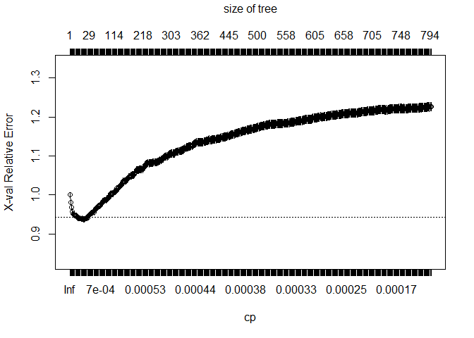<!-- -->


```r
# Very detailed summary of splits, un-comment the code below and execute to see
# summary(linear.singletree)

# prune the tree
op.index <- which.min(linear.singletree$cptable[, "xerror"])
cp.vals <- linear.singletree$cptable[, "CP"]
treepruned.linearsingle <- prune(linear.singletree, cp = cp.vals[op.index])
```

#### Instructor's Note:
Some people prefer using 1 SE rule to plot a decent tree -
find the cp corresponding to the largest error within 1 SE of the 
xerror corresponding to the min cp


```r
# apply model to the test set to get predictions
singletree.pred.calss <- predict(treepruned.linearsingle, newdata=processed.scaled.test)

# plot tree
plot(treepruned.linearsingle, uniform = TRUE,
     main = "Classification Tree Example")
text(treepruned.linearsingle, use.n=TRUE, all=TRUE, cex=0.8)
```

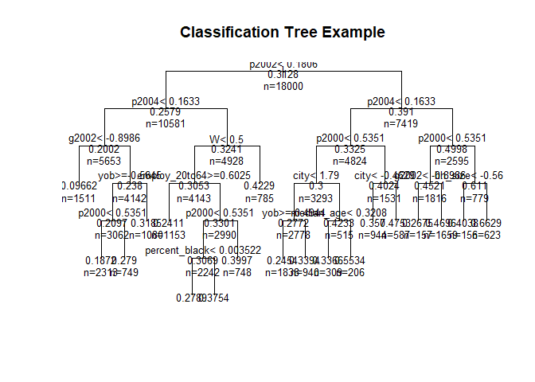<!-- -->


```r
# create attractive postscript plot of tree
# better ... and saves to current directory
post(treepruned.linearsingle, file = "tree.ps",
     title = "Classification Tree Example")

# Visualize (the first few layers of) the tree
# We would need to adjust the complexity parameter cp 
visual.pruned.tree <- prune(linear.singletree, cp = 0.003)
plot(visual.pruned.tree, uniform = TRUE,
     main = "Visualize the First Few Layers of the Tree")
text(visual.pruned.tree, use.n=TRUE, all = TRUE, cex=0.8)
```

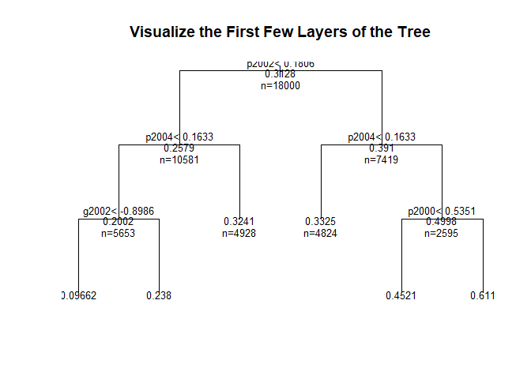<!-- -->


```r
post(visual.pruned.tree, file = "visual_tree.ps",
     title = "Visualize the First Few Layers of the Tree")
```

### Random Forest (Single Forest)
use linear formula

We first set the outcome variable as factor to indicate that we want to do classification with random forest


```r
processed.scaled.train$Y <- as.factor(processed.scaled.train$Y)

# fitting the model
set.seed(135)
fit.rf <- randomForest(linear, processed.scaled.train, ntree = 50, do.trace = 10)
```

```
## ntree      OOB      1      2
##    10:  36.60% 21.45% 69.87%
##    20:  34.07% 15.65% 74.54%
##    30:  33.23% 13.40% 76.80%
##    40:  32.54% 11.47% 78.85%
##    50:  31.72%  9.96% 79.54%
```


```r
summary(fit.rf)
```

```
##                 Length Class  Mode     
## call                5  -none- call     
## type                1  -none- character
## predicted       18000  factor numeric  
## err.rate          150  -none- numeric  
## confusion           6  -none- numeric  
## votes           36000  matrix numeric  
## oob.times       18000  -none- numeric  
## classes             2  -none- character
## importance         34  -none- numeric  
## importanceSD        0  -none- NULL     
## localImportance     0  -none- NULL     
## proximity           0  -none- NULL     
## ntree               1  -none- numeric  
## mtry                1  -none- numeric  
## forest             14  -none- list     
## y               18000  factor numeric  
## test                0  -none- NULL     
## inbag               0  -none- NULL     
## terms               3  terms  call
```


```r
print(fit.rf)
```

```
## 
## Call:
##  randomForest(formula = linear, data = processed.scaled.train,      ntree = 50, do.trace = 10) 
##                Type of random forest: classification
##                      Number of trees: 50
## No. of variables tried at each split: 5
## 
##         OOB estimate of  error rate: 31.72%
## Confusion matrix:
##       0    1 class.error
## 0 11138 1232   0.0995958
## 1  4478 1152   0.7953819
```


```r
imp.fit.rf <- randomForest::importance(fit.rf)

plot(fit.rf)
```

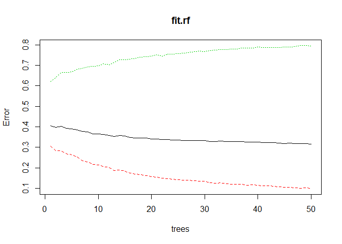<!-- -->


```r
plot(imp.fit.rf, lty=2, pch = 16)
lines(imp.fit.rf)
```

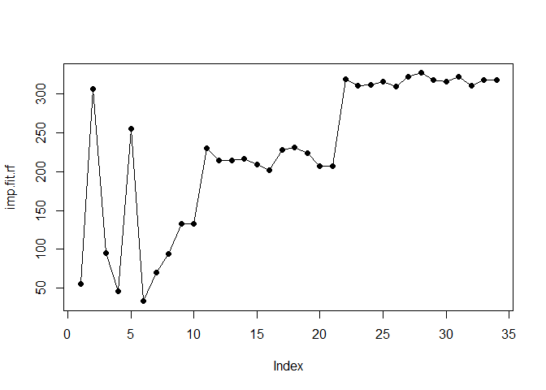<!-- -->


```r
# Create partial dependence plots
imp <- imp.fit.rf
impvar <- rownames(imp)[order(imp[, 1], decreasing = TRUE)]
op <- par(mfrow=c(2,2))
for (i in seq_along(impvar)) {
  partialPlot(fit.rf, processed.scaled.train, impvar[i], xlab=impvar[i],
              main=paste("Partial Dependence on", impvar[i]),
              ylim=c(0, 1))
}
```

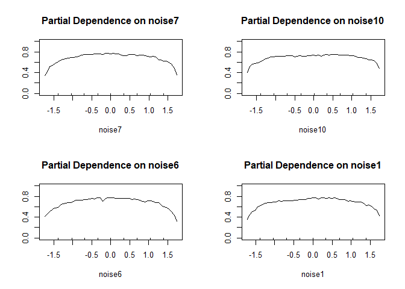<!-- -->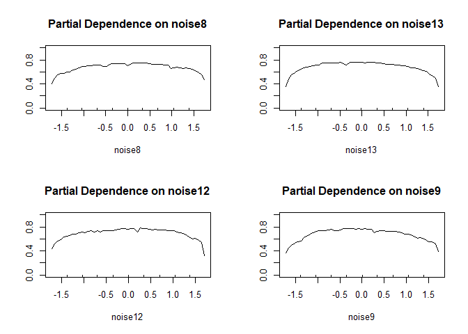<!-- -->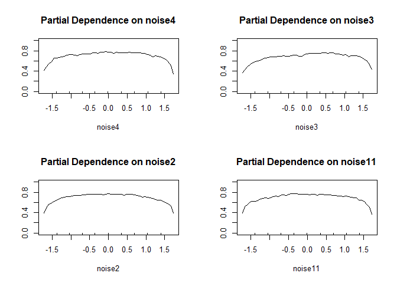<!-- -->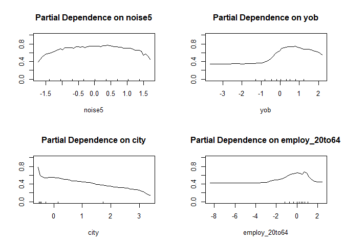<!-- -->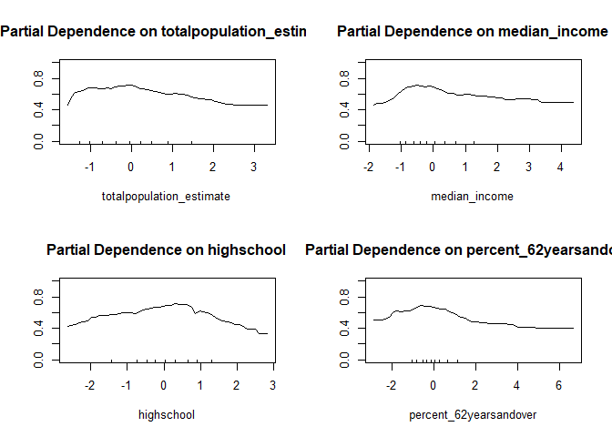<!-- -->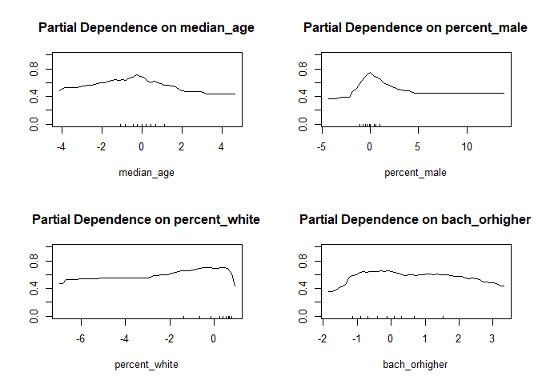<!-- -->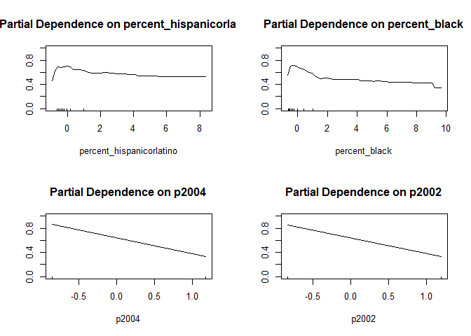<!-- -->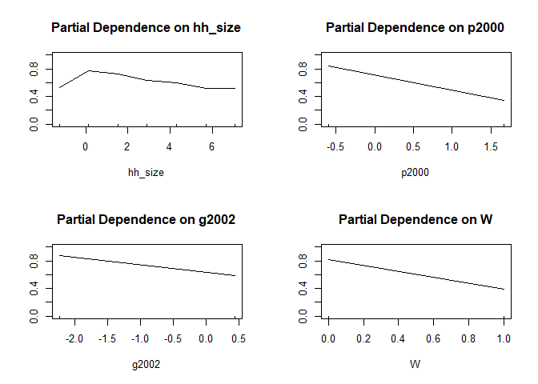<!-- -->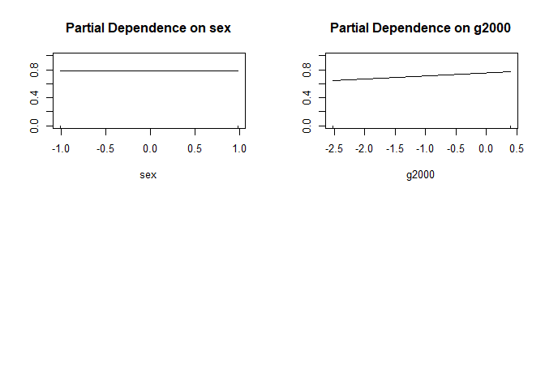<!-- -->


```r
# Predict Output
predicted <- predict(fit.rf, processed.scaled.test)

par(mfrow=c(1, 1))
```


```r
varImpPlot(fit.rf)
```

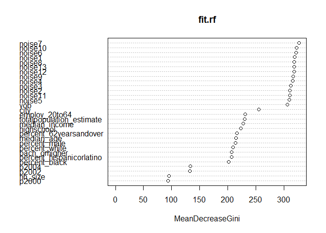<!-- -->
